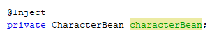
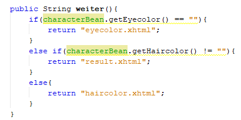

In diesem Portfolio erläutere ich meine Erkenntnisse zum Problem, dass man über eine Methode, je nach Input, verschiedene Seiten angezeigt werden.
<!--break-->

## Beschreibung

Als ich diese Teilaufgabe gelesen habe, konnte ich mir relativ schnell vorstellen wie ich es machen würde. Ich habe 3 Verschiedene Faces, eine "Character bean" für die Variablen und dessen getter/setter und eine "Controller bean", in der ich die gefragte Methode einbauen würde.

der Erste schritt, war es, die "Character bean" in die "Controller bean" zu "injecten", d. h. die "Controller bean" kennt die Variablen der "Character bean" und dessen getter/setter. Das ging ganz einfach mit 2 Zeilen code: 

Als Nächstes kam direkt die Methode. Das erste was mir einfiel, und was Schlussendlich auch funktionierte war eine "if" Verzweigung. Besser gesagt eine "if-else if", weil ich 2 Bedingungen brauchte. Ich dachte mir folgendes:  Über die 3 Seiten werden Informationen gespeichert. Am Anfang sind jedoch alle Variablen leer. Das heisst, dass ich diese Variablen als Bedingung Brauchen kann. 

Der Code, unten auf der Abbildung, zeigt die Methode, die entscheidet welche Seite zurückgegeben wird. Zuerst wird nachgeschaut, ob die Augenfarbe, die zweite Eigenschaft, einen Wert hat (Die Verzweigung fängt bewusst bei der zweiten Eigenschaft an, weil schon auf der ersten Seite die erste Eigenschaft abgefragt wird). Falls ja, wird die zweite Seite als String zurückgegeben. Falls nicht, wird nachgeschaut, ob die dritte Eigenschaft einen Wert hat. Falls ja, wird die Schlussseite zurückgegeben (vierte Seite). Falls nicht, gibt es nur noch die die dritte Seite als Möglichkeit.

## Code Abbildung

## Demonstrationsvideo

<video width="320" height="240" controls>
  <source src="images/demoVideo.mp4" type="video/mp4">
</video>

## Reflexion

Ich fand diesen Auftrag spannend. Ich musste bei diesem Auftrag viel gelerntes aus den letzten Wochen zusammentragen. Aus zeitlichen Gründen konnte ich jedoch diesen Auftrag im Unterricht nicht fertigstellen, was auch erklärt, warum auf dem Video nur bei der ersten Seite die Abbildungen zu sehen sind.

Auch stockte ich längere Zeit bei einem kleinen Problem, welches ich erst spät bemerkte. Ich hatte die Variablen zwar deklariert aber nicht initialisiert, was zu dem Fehler führte, dass ich immer direkt zur letzten Seite weitergeleitet wurde. Nachdem ich alle Strings leer gesetzt habe (Stringname = ""), funktionierte es perfekt.

Daruas lerne ich, immer allen Variablen auch gleich bei der Deklaration einen Startwert zu geben. So hätte ich viel Zeit und Mühe gespart bei der Fehlersuche und beim ausprobieren, ob es wirklich funktioniert.

**Zielerfüllung:**
1. Die Seiten werden dynamisch über eine Methode aufgerufen, im Video wird das gezeigt.
2. Dieses Ziel kann ich zwar nicht wirklich beweisen aber ich habe es geschafft, die Logik selbst zu schreiben. Auch bei der Fehlersuche brauchte ich keine Hilfe, dem entsprechend aber  Zeit.
