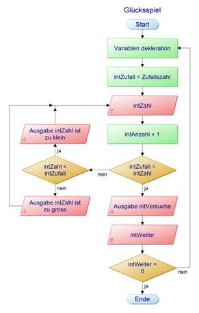

In diesem Portfolio beschreibe ich die Unterscheide, die ich zwischen PowerShell und Python bemerkte, beim Schreiben des Glücksspiel-Skripts
<!--break-->

## Aufgabenstellung

Die Aufgabe war es, den Lernauftrag LA_122_77207_GluecksSpiel zu lösen. Dessen genaue Aufgabenstellung war:

Die Idee vom Kunden ist es ein Spiel zu entwickeln, in welchem eine Zufallszahl erraten wird.

- Das Programm generiert eine Zufallszahl zwischen 1 und 100.
- Der Benutzer wird nach der Eingabe gefragt
- Es muss eine Meldung kommen, ob die getippte Zahl grösser oder kleiner ist als die Zufallszahl.
- Wird die Zahl richtig erraten, muss angezeigt werden, wie viele Versuche gebraucht wurden, bis die Zufallszahl erraten wurde.

Nachdem man Das Skript in PowerShell geschrieben hatte, musste man nun das Gleiche in Python implementieren. 

## Ziele

**Die gegebenen Ziele waren:**

- Sie können mit PowerShell ein Struktogramm implementieren.
- Sie können selbstständig ein Struktogramm planen und dieses implementieren.
- Das gleiche Skript in Python implementieren.

**Meine eigenen Ziele deckten sich eigentlich mit den gegebenen:**

- Ich kann ein einfaches Skript mit Python implementieren.

## Produkt

Die erste Aufgabe des Lernauftrags LA_122_77207_GluecksSpiel war es, ein Struktogramm zu entwerfen. Als Vorlage bekam man dieses PAP:

Diese Aufgabe habe ich nicht gelöst, weil wir zuvor schon viele Struktogramme gemacht haben und ich dachte, dass ich auch gleich vom PAP ein Skript schreiben kann.

Also fing ich an, die Schritte des PAPs in meinem PowerShell-Skript umzusetzen. Vieles lief reibungslos. Hin und wieder musste ich dann aber doch eine do-while schleife weiter oben einfügen, welches ich mit einem Struktogramm hätte vermeiden können. Den Rest konnte ich ohne Probleme vom PAP nehmen.

Nun war es also Zeit, dieses Skript in Python nachzuschreiben. Ich habe ein bisschen auf dem Internet nach code Abfolgen, welche ich brauchen würde, recherchiert und habe bemerkt, dass sich Python von PowerShell gar nicht so unterscheidet.

Mit dem PowerShell-Skript zur Seite konnte ich die Struktur fast 1 zu 1 abnehmen. Für jeden Funktionsschritt im PowerShell-Skript schaute ich auf dem Internet nach der Python alternative. Das grösste Problem war, dass es in Python keine do-while Schleife gibt. So musste ich normale while Schleifen brauchen und sie ein bisschen von der PowerShell Version abändern.

## Reflexion

Ich fand diesen Auftrag sehr gut. Ich hatte das Gefühl, diese Aufgabe sei eine gute Vorbereitung für die LB, da man eigentlich alle Hauptthemen behandelte. Analysieren von PAPs, Erstellen eines Struktogramms, und Implementierung eines PowerShell code, basierend auf ein Struktogramm. 

Bei der Python-Aufgabe war ich zuerst ein bisschen verloren, ich wusste nicht wie anzufangen, Eine Neue Skriptsprache zu lernen. Als ich aber aufhörte zu zögern und angefangen habe, mir Codestellen im Internet mit PowerShell zu vergleichen, erkannte ich, dass es vielleicht gar nicht so schwierig werden würde. Die Logik des Skripts hatte ich schon, und ich wusste schon, dass die Struktur ebenfalls dieselbe sein würde. Jetzt war es einfach Übersetzungsarbeit.

Leider hat dies aber nicht gereicht. Mein Python-Skript schliesst sich jedes Mal nach der ersten Abfrage der Geheimzahl. Da sich die Konsole jedes Mal schliesst gab es auch keine Fehlermeldung. Auch in Visual Studio Code zeigt es mir keine Fehler an. Es ist schade, dass ich das Projekt abgeben muss, ohne dass es fertig ist, aber ich finde den Fehler nicht.

## Zielerfüllung

**Die gegebenen Ziele waren:**

- Sie können mit PowerShell ein Struktogramm implementieren. ✘

Nicht erledigt, weil es nicht zu diesem Portfolio relevant war.

- Sie können selbstständig ein Struktogramm planen und dieses implementieren. ✘

Das PowerShell-Skript ist nach dem gegebenen PAP geschrieben.

- Das gleiche Skript in Python implementieren. ✓

Das Python Skript hat nach dem PAP die gleiche Funktionalität.

**Meine eigenen Ziele deckten sich eigentlich mit den gegebenen:**

- Ich kann ein einfaches Skript mit Python implementieren. ✓
Das Pythonskript ist unten verlinkt.

## Unterschiede

Der wichtigste Unterschied, den ich bei der Umsetzung bemerkte, war, dass es die do-while Schleife nicht gibt, und dass Logischerweise die Syntax unterschiedlich ist. Beispielsweise die Leerschläge. In vielen Programmier- und Skriptsprachen spielen Leerschläge nur zur Leserlichkeit eine Rolle. Aber nicht in Python. Anstelle von geschweiften Klammern benutzt man Leerschläge. Diese Regel gilt für alle Arten von Iterationen und Alternationen. Es ist egal, wie viele Leerschläge man für eine Abfolge setzt. Wichtig ist nur, dass man immer gleich viele setzt.

Ich kann mir nicht wirklich Vor- und Nachteile ausdenken welche für oder gegen Python sprechen. Aber ich fand es mühsam von Python, dass ich es nicht in Visual Studio Code ausführen konnte. Ich weiss nicht, ob das an meiner Datei liegt. Aber ich hätte mich mehr über eine Fehlermeldung gefreut, welche mir wenigstens einen Hinweis gibt, anstatt dass sich die Konsole schliesst und ich nun keine Ahnung hab, was das Problem ist.

Ansonsten fand ich Python, sowie auch PowerShell, von der Sprache her einfach zu verstehen. Damit meine ich, dass man aus den Code Zeilen relativ schnell herausfinden kann, was sie machen. Das Spielt auch mit der gezwungenen Indentation zusammen. 

## Code download

Sie können mein Powershell-Skript <a href="files/Gluecksspiel.ps1" download>hier</a> herunterladen.

Sie können mein Python-Skript <a href="files/Gluecksspiel.py" download>hier</a> herunterladen.
